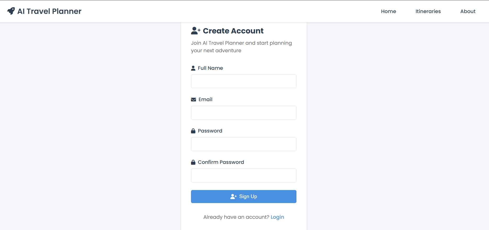
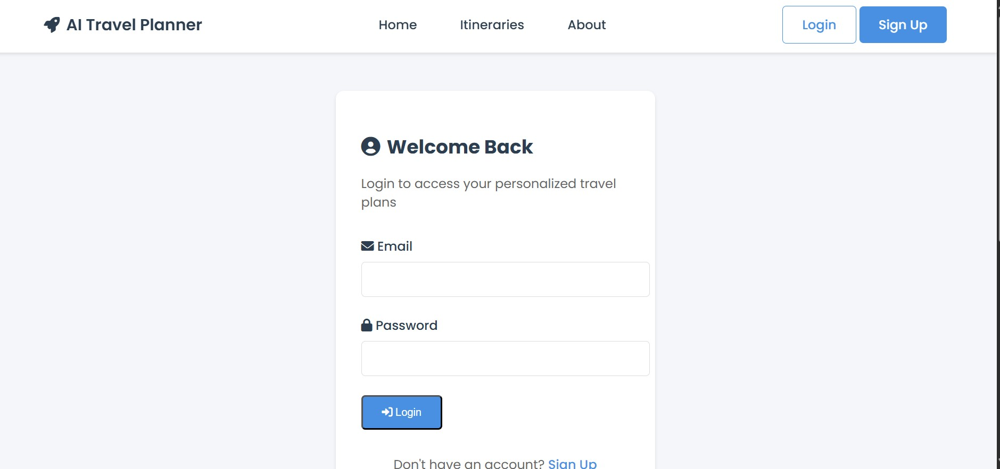
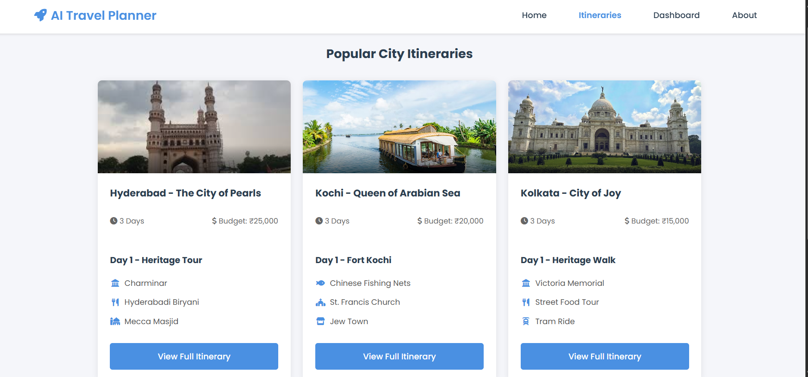
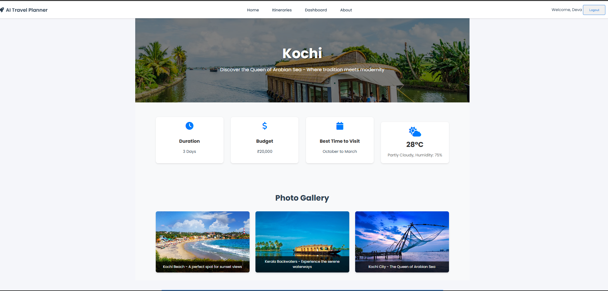
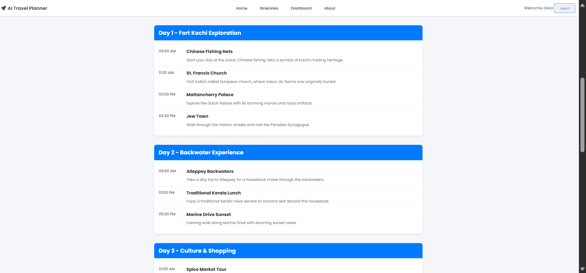
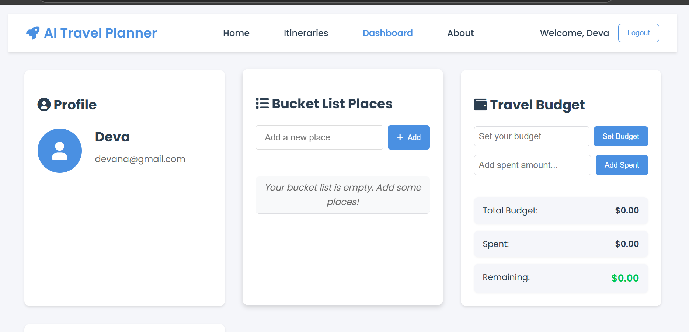
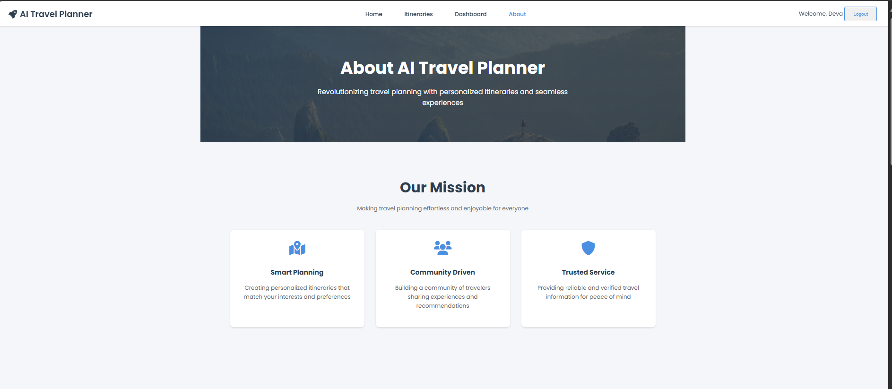
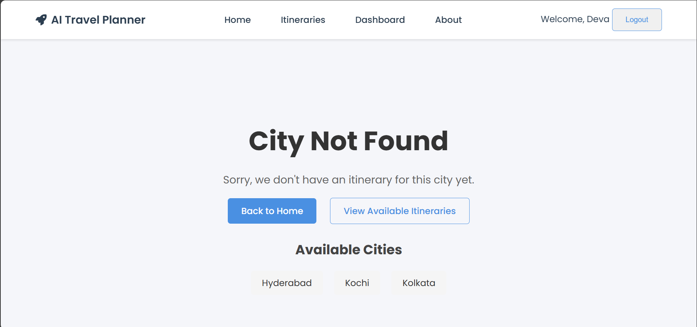

# Travel Itinerary Management System
A web-based application for managing travel itineraries across different cities in India.

## Project Structure
### Frontend Components
#### HTML Components
- **About & Not Found Pages** (Anandhu)

    - About page
    - 404 Not Found page
  
- **Authentication Pages** (Devanarayan)

    - Sign Up page
    - Login page
    - Kochi city page
  
- **Dashboard & City Pages** (Srijita)

    - Dashboard interface
    - Kolkata city page
- **City & Itinerary Pages** (Nissi)

    - Hyderabad city page
    - Itinerary pages

### CSS Components
- **About & Authentication Styles** (Anandhu)

    - About page styling
    - Authentication pages styling

- **City & Itinerary Styles** (Nissi)

    - City pages styling
    - Itinerary pages styling
    - Common CSS components

- **Dashboard & Global Styles** (Srijita)

    - Dashboard styling
    - Global CSS components
  
- **Index & Login Styles** (Devanarayan)

    - Index page styling
    - Login page styling

### JavaScript Components
- **Dashboard & CSS Validation** (Srijita)

    - Dashboard functionality
    - CSS validation checks

- **Index Page** (Devanarayan)
    - Authentication Logic of signup and login

- **Authentication & Common JS** (Anandhu)

    - Index page fucntionalitites
    - Common JavaScript utilities

- **Itinerary Management** (Nissi)

    - Itinerary-related functionality
  
## Team Members and Contributions
### Anandha Krishnan
- About page development
- Not Found page implementation
- Authentication styling
- Common JavaScript utilities

### P V Devanarayan
- Sign Up and Login pages
- Kochi city page
- Index page styling and functionality
- Login page styling

### Srijita Sarkar
- Dashboard development
- Kolkata city page
- Global CSS components
- CSS validation and checks

### Jonnada Nissi
- Hyderabad city page
- Itinerary pages
- City and itinerary styling
- Itinerary management functionality

##  Features and Working 
- User authentication (Sign Up/Login)
- Password verification
- Restricts users from accessing the city specific itinerary pages.
- There is a protected dashboard page which can only be viewed when signed in.
- City-specific travel information
- Interactive dashboard
- Itinerary management
- Access to personal resumes in the ABOUT page when clicked on thier respective names in the founders card
- Responsive design
  

## Technologies Used
- HTML5
- CSS3
- JavaScript
- Modern web development practices

## Getting Started
- Clone the repository
- Open the project in your preferred code editor
- Launch the application using a local server
- The site can be viewed directly through the vercel app link provided in the links

## Screenshots

### Signup page

### Login page 

### Home Page

### Itineraries Page
- Can be accessed only after logging in.
  

### City Specific Page - 3 Nos
- Shows the detailed itinerary of each of the cities. Requires login.
  

### Dashboard Page 
- Inlcudes adding to bucket list and calculating the budget
  

### About Page
- Includes the info about the page founders.
- Resumes can be accessed when clicked on the respective names.
  

### Not found page
- Shown when then user types in an invalid city in the home page search bar.
  

